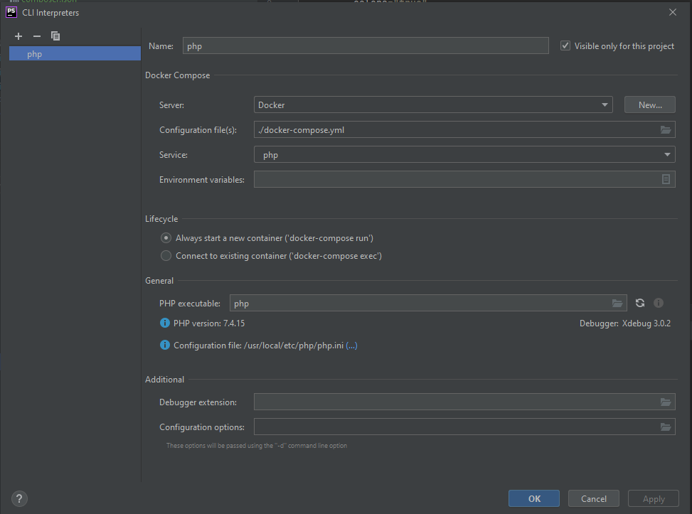
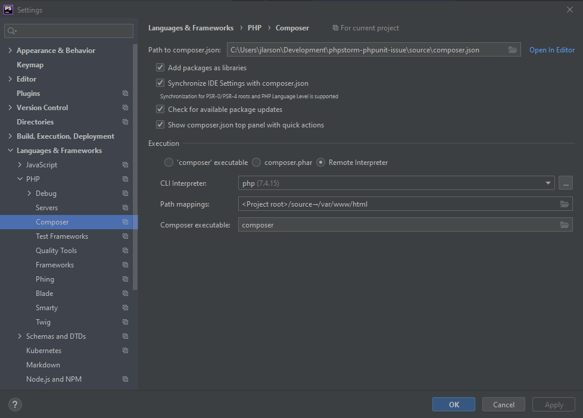
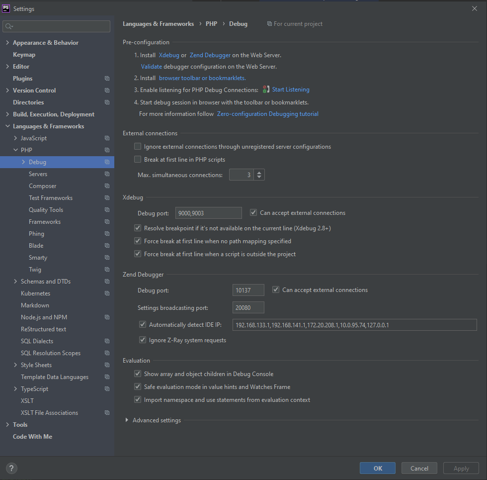
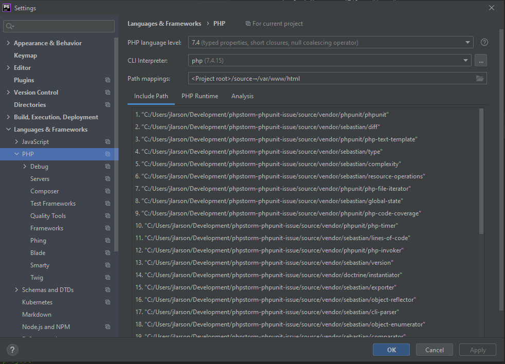
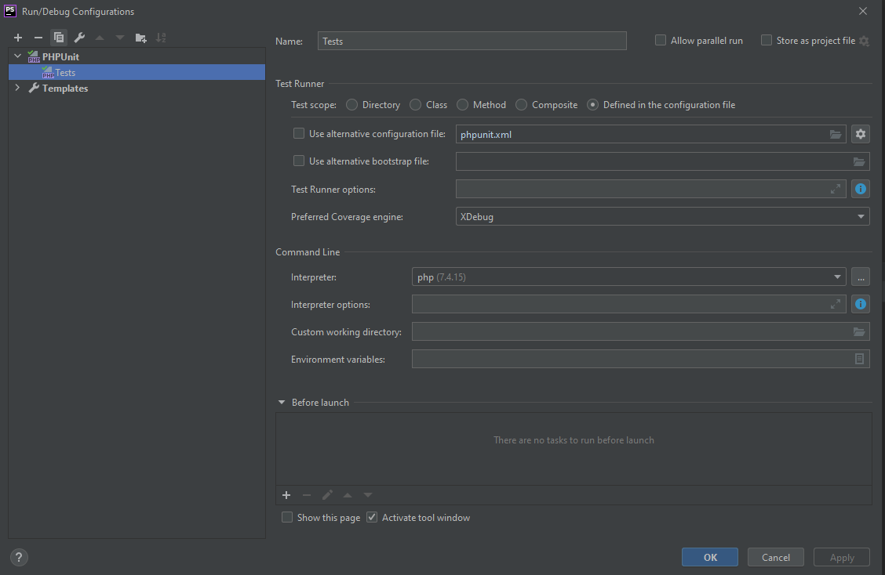
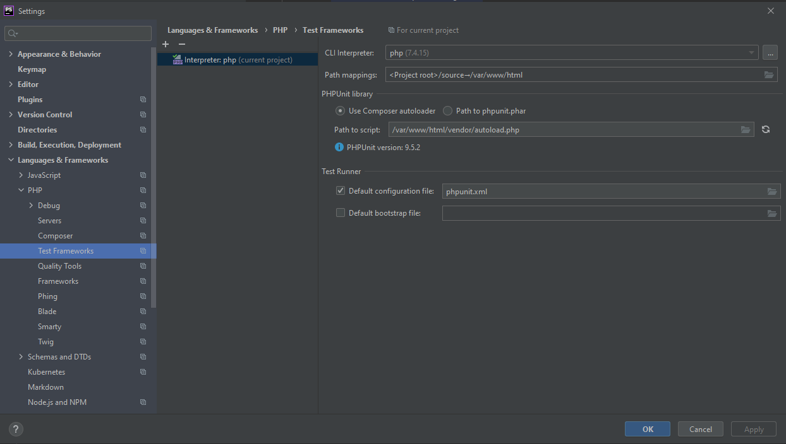
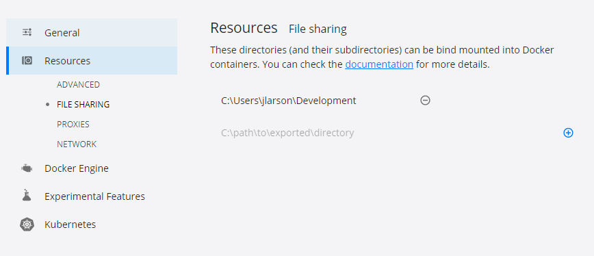

# Issue

Running a PHPUnit run configuration with coverage results in the following stacktrace:

```
[docker-compose://[C:\Users\jlarson\Development\phpstorm-phpunit-issue\docker-compose.yml]:php/]:php -dxdebug.mode=coverage /var/www/html/vendor/phpunit/phpunit/phpunit --coverage-clover /opt/phpstorm-coverage/phpstorm_phpunit_issue@Tests.xml --configuration phpunit.xml --teamcity
Testing started at 6:47 PM ...
Creating phpstorm-phpunit-issue_php_run ... 
Creating phpstorm-phpunit-issue_php_run ... error
WatsonBuckets  System.Collections.IDictionarySystem.Excepti      Docker.Core.DockerException   Filesharing has been cancelled


   \u015a   at Docker.ApiServices.Mounting.FileSharing.<DoShareAsync>d__8.MoveNext() in C:\workspaces\PR-15138\src\github.com\docker\pinata\win\src\Docker.ApiServices\Mounting\FileSharing.cs:line 0
--- End of stack trace from previous location where exception was thrown ---
   at System.Runtime.ExceptionServices.ExceptionDispatchInfo.Throw()
   at System.Runtime.CompilerServices.TaskAwaiter.HandleNonSuccessAndDebuggerNotification(Task task)
   at Docker.ApiServices.Mounting.FileSharing.<ShareAsync>d__6.MoveNext() in C:\workspaces\PR-15138\src\github.com\docker\pinata\win\src\Docker.ApiServices\Mounting\FileSharing.cs:line 55
--- End of stack trace from previous location where exception was thrown ---
   at System.Runtime.ExceptionServices.ExceptionDispatchInfo.Throw()
   at System.Runtime.CompilerServices.TaskAwaiter.HandleNonSuccessAndDebuggerNotification(Task task)
   at Docker.HttpApi.Controllers.FilesharingController.<ShareDirectory>d__2.MoveNext() in C:\workspaces\PR-15138\src\github.com\docker\pinata\win\src\Docker.HttpApi\Controllers\FilesharingController.cs:line 21
--- End of stack trace from previous location where exception was thrown ---
   at System.Runtime.ExceptionServices.ExceptionDispatchInfo.Throw()
   at System.Runtime.CompilerServices.TaskAwaiter.HandleNonSuccessAndDebuggerNotification(Task task)
   at System.Threading.Tasks.TaskHelpersExtensions.<CastToObject>d__1`1.MoveNext()
--- End of stack trace from previous location where exception was thrown ---
   at System.Runtime.ExceptionServices.ExceptionDispatchInfo.Throw()
   at System.Runtime.CompilerServices.TaskAwaiter.HandleNonSuccessAndDebuggerNotification(Task task)
   at System.Web.Http.Controllers.ApiControllerActionInvoker.<InvokeActionAsyncCore>d__1.MoveNext()
--- End of stack trace from previous location where exception was thrown ---
   at System.Runtime.ExceptionServices.ExceptionDispatchInfo.Throw()
   at System.Runtime.CompilerServices.TaskAwaiter.HandleNonSuccessAndDebuggerNotification(Task task)
   at System.Web.Http.Controllers.ActionFilterResult.<ExecuteAsync>d__5.MoveNext()
--- End of stack trace from previous location where exception was thrown ---
   at System.Runtime.ExceptionServices.ExceptionDispatchInfo.Throw()
   at System.Runtime.CompilerServices.TaskAwaiter.HandleNonSuccessAndDebuggerNotification(Task task)
   at System.Web.Http.Dispatcher.HttpControllerDispatcher.<SendAsync>d__15.MoveNext()
       \u01418
MoveNext
Docker.ApiServices, Version=3.0.2.51106, Culture=neutral, PublicKeyToken=null
Docker.ApiServices.Mounting.FileSharing+<DoShareAsync>d__8
Void MoveNext() �   Docker.ApiServices

WatsonBuckets  System.Collections.IDictionarySystem.Excepti      Docker.Core.DockerException   Filesharing has been cancelled


   \u015a   at Docker.ApiServices.Mounting.FileSharing.<DoShareAsync>d__8.MoveNext() in C:\workspaces\PR-15138\src\github.com\docker\pinata\win\src\Docker.ApiServices\Mounting\FileSharing.cs:line 0
--- End of stack trace from previous location where exception was thrown ---
   at System.Runtime.ExceptionServices.ExceptionDispatchInfo.Throw()
   at System.Runtime.CompilerServices.TaskAwaiter.HandleNonSuccessAndDebuggerNotification(Task task)
   at Docker.ApiServices.Mounting.FileSharing.<ShareAsync>d__6.MoveNext() in C:\workspaces\PR-15138\src\github.com\docker\pinata\win\src\Docker.ApiServices\Mounting\FileSharing.cs:line 55
--- End of stack trace from previous location where exception was thrown ---
   at System.Runtime.ExceptionServices.ExceptionDispatchInfo.Throw()
   at System.Runtime.CompilerServices.TaskAwaiter.HandleNonSuccessAndDebuggerNotification(Task task)
   at Docker.HttpApi.Controllers.FilesharingController.<ShareDirectory>d__2.MoveNext() in C:\workspaces\PR-15138\src\github.com\docker\pinata\win\src\Docker.HttpApi\Controllers\FilesharingController.cs:line 21
--- End of stack trace from previous location where exception was thrown ---
   at System.Runtime.ExceptionServices.ExceptionDispatchInfo.Throw()
   at System.Runtime.CompilerServices.TaskAwaiter.HandleNonSuccessAndDebuggerNotification(Task task)
   at System.Threading.Tasks.TaskHelpersExtensions.<CastToObject>d__1`1.MoveNext()
--- End of stack trace from previous location where exception was thrown ---
   at System.Runtime.ExceptionServices.ExceptionDispatchInfo.Throw()
   at System.Runtime.CompilerServices.TaskAwaiter.HandleNonSuccessAndDebuggerNotification(Task task)
   at System.Web.Http.Controllers.ApiControllerActionInvoker.<InvokeActionAsyncCore>d__1.MoveNext()
--- End of stack trace from previous location where exception was thrown ---
   at System.Runtime.ExceptionServices.ExceptionDispatchInfo.Throw()
   at System.Runtime.CompilerServices.TaskAwaiter.HandleNonSuccessAndDebuggerNotification(Task task)
   at System.Web.Http.Controllers.ActionFilterResult.<ExecuteAsync>d__5.MoveNext()
--- End of stack trace from previous location where exception was thrown ---
   at System.Runtime.ExceptionServices.ExceptionDispatchInfo.Throw()
   at System.Runtime.CompilerServices.TaskAwaiter.HandleNonSuccessAndDebuggerNotification(Task task)
   at System.Web.Http.Dispatcher.HttpControllerDispatcher.<SendAsync>d__15.MoveNext()
       \u01418
MoveNext
Docker.ApiServices, Version=3.0.2.51106, Culture=neutral, PublicKeyToken=null
Docker.ApiServices.Mounting.FileSharing+<DoShareAsync>d__8
Void MoveNext() �   Docker.ApiServices
Encountered errors while bringing up the project.
```

# Setup

Requires Docker for Windows
* WSL1
* Non experimental
* Docker > Settings > Resources > File Sharing set to a folder in home directory (ie: C:\Users\<username>\Development)

Build the docker images
```
docker-compose build
```

In PHPStorm:

Setup PHP runtime with docker-compose and "php" service.

Setup test framework for phpunit remote

Setup run configuration







